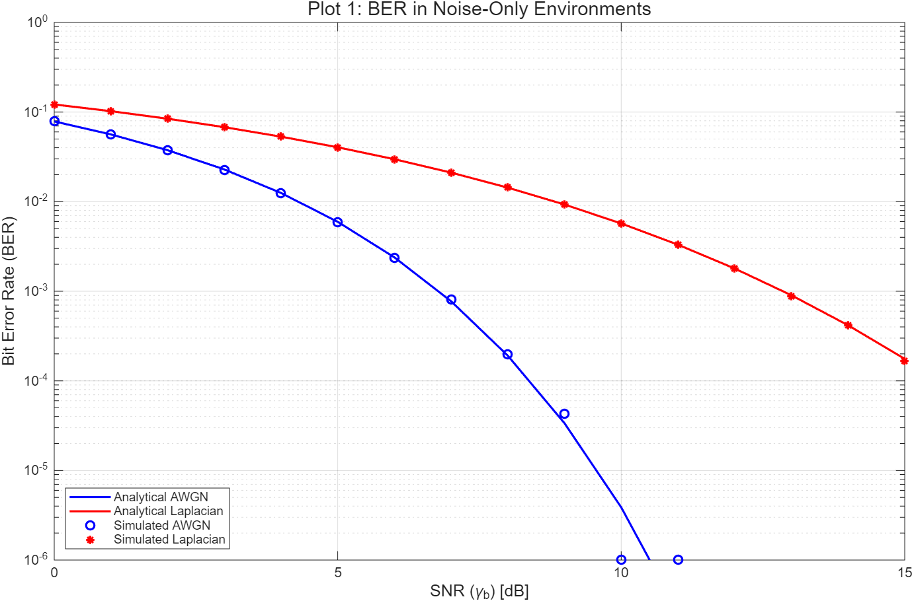
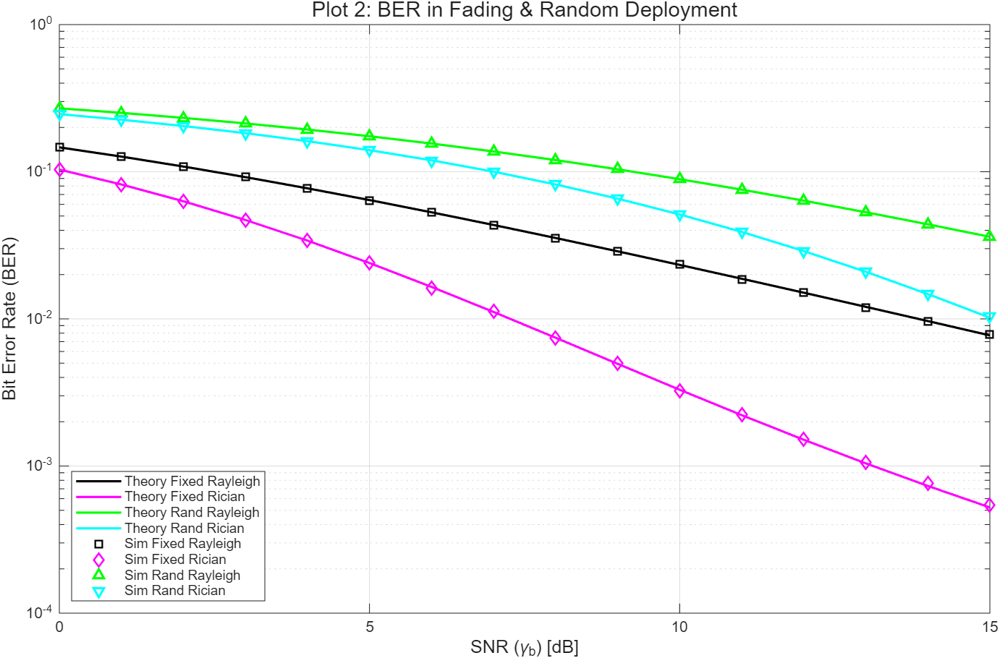
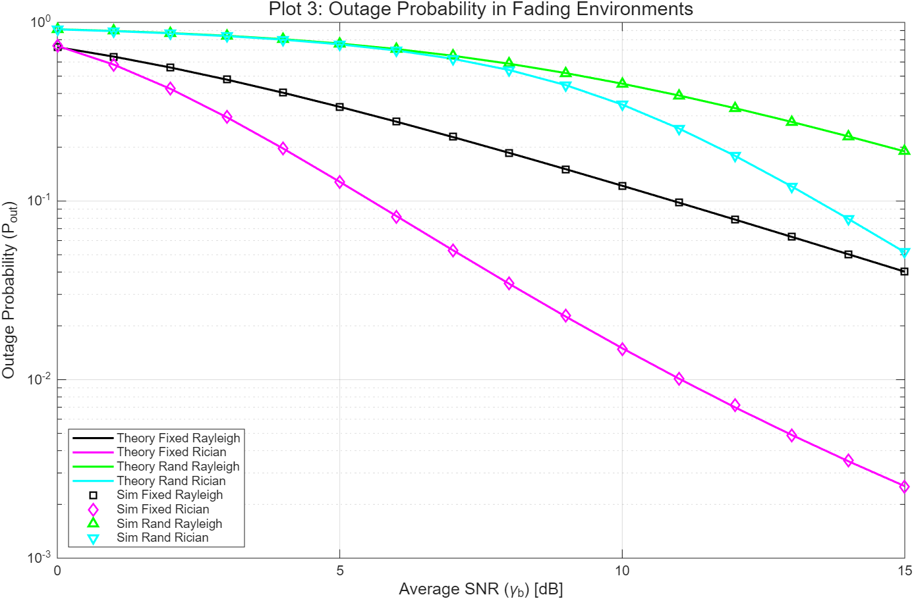
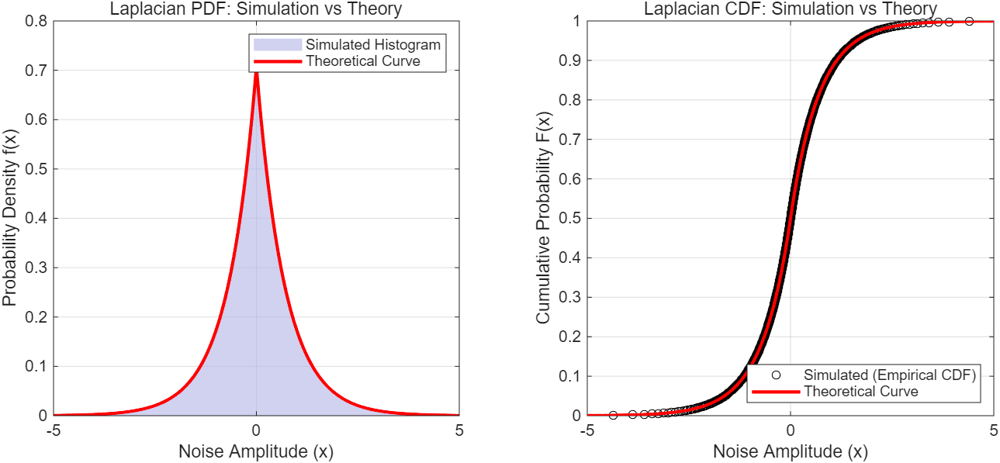

# BPSK Wireless Channel Simulator

A MATLAB-based Monte Carlo simulation of BPSK communication over various wireless channel models.

## Overview

This project evaluates the performance of a BPSK communication system under different wireless channel conditions using Monte Carlo simulations.

The simulation considers both **Bit Error Rate (BER)** and **Outage Probability** as performance metrics.

## Channel Models

The following channel conditions are considered:

- AWGN
- Laplacian impulsive noise
- Rayleigh fading with AWGN
- Rician fading with AWGN
- Rayleigh fading with random user deployment and path loss
- Rician fading with random user deployment and path loss

## Methods

The project includes:

- Monte Carlo simulation of BPSK transmission
- Rayleigh and Rician fading channel modeling
- Random spatial deployment of users
- Distance-dependent path loss
- Analytical BER and outage probability calculation
- Comparison between simulation and analytical results

## Tools

- MATLAB

## Getting Started

### Requirements

- MATLAB

### Running the Simulation

1. Clone or download this repository.
2. Open the project folder in MATLAB.
3. Run `Main.m`.

The script performs Monte Carlo simulations for the different channel models and compares the simulated results with analytical results.

## Results

### BER in Noise-Only Environments

The simulated BER closely follows the analytical results for both AWGN and Laplacian noise. Compared with AWGN, Laplacian impulsive noise results in a significantly slower BER reduction as the SNR increases.

### BER under Fading and Random User Deployment

The BER performance is evaluated under Rayleigh and Rician fading for both fixed-distance and randomly deployed users. The simulation results closely agree with the corresponding analytical models.

Random user deployment introduces additional performance degradation due to distance-dependent path loss.

### Outage Probability

The outage probability is evaluated for Rayleigh and Rician fading channels. Both fixed-distance and randomly deployed user scenarios are considered and compared with analytical results.

### Laplacian Noise Verification

The generated Laplacian noise samples are verified by comparing their empirical PDF and CDF with the corresponding theoretical distributions.

